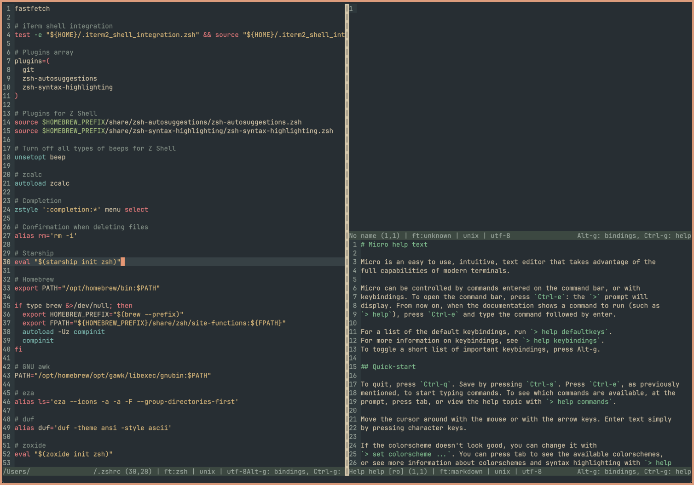

# Everforest Micro
Everforest for the Micro text editor.

 

* [Micro text editor](https://micro-editor.github.io/)

* [Everforest color scheme](https://github.com/sainnhe/everforest)

* [Everforest website](https://everforest.vercel.app/)

* [Everforest for Starship](https://github.com/martelo11/starship-everforest-themes) 

Place file in ~/.config/micro/colorschemes/ (create a new folder named colorschemes if non-existing).

Open the Micro text editor, press control+e and type "set colorscheme everforest" (without quotation marks) and press enter.

Done.

